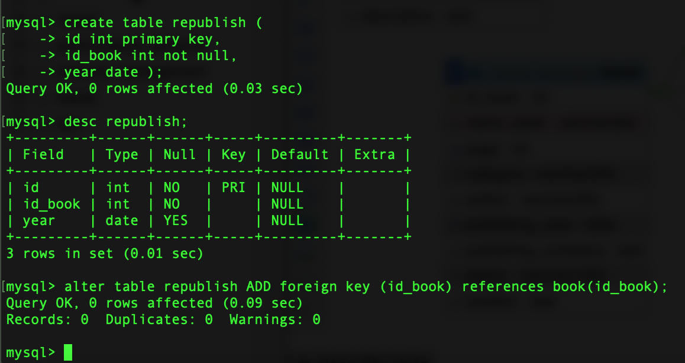
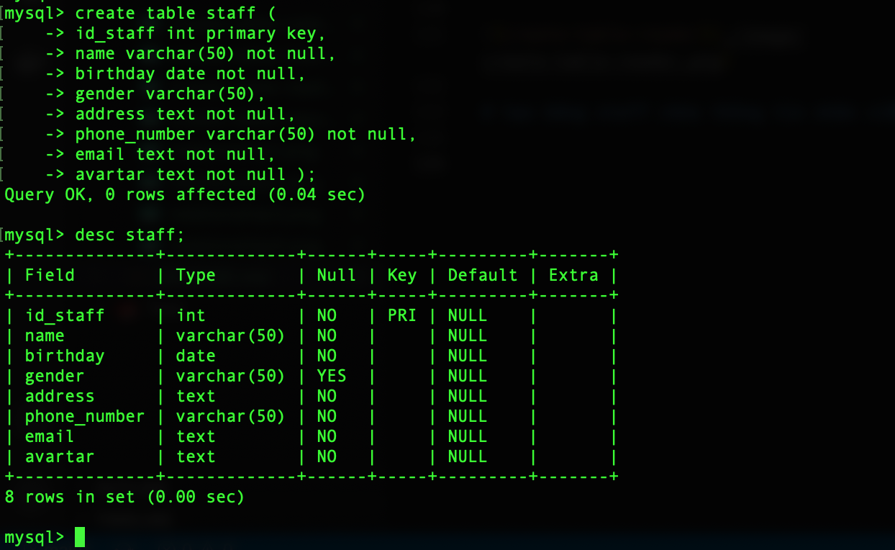

# Câu hỏi:
Xây dựng database quản lý thư viện, biết:

* Sách(id, tên, số trang, thể loại, tác giả, năm xuất bản, nhà xuất bản, tính trạng, vị trí)
* Thể loại(id, tên thể loại)
* sách_thể loại(id_sách, id_thể loại)
* Tác giả(id, tên , ngày sinh, quê quán, mô tả)
* sách_tác giả (id sach, id tác giả)
* Tái bản(id, id_sách, năm)
* Phiếu mượn(id, id_độc giả, id_nhan viên, ngày mượn, ngày hẹn trả )
* Chi tiết mượn(id_phiếu mượn, id sách, số lượng)
* Độc giả(id, tên , ngày sinh, giới tính, địa chỉ, sđt, email)
* Nhân viên(id, tên , ngày sinh, giới tính, địa chỉ, sđt, email, avatar)
* Phiếu trả(id, id phiếu mượn, ngày trả)

# Tạo database book_manager để quản lý thư viện
    create database book_manager;

# Tạo table book chứa thông tin sách

    mysql> use book_manager
    Database changed
    mysql> create table book (
        -> id_book int primary key,
        -> name_book varchar(50) not null,
        -> page int not null,
        -> category varchar(50) not null,
        -> author varchar(50) not null,
        -> publishing_year date not null,
        -> publishing_company text not null,
        -> status varchar(100) not null,
        -> location text not null
        -> );

# Tạo table category chứa các thể loại

    create table category (
    -> id_category int primary key,
    -> name_category varchar(100) not null );

# Tạo table book_category để liên kết 2 bảng sách và thể loại

Vì quan hệ giữa 2 bảng: book và category là quan hệ nhiều - nhiều, 1 quyển sách có thể có nhiều thể loại và 1 thể loại có thể có nhiều sách nên cần tạo 1 bảng trung gian là book_category. Bảng trung gian này cần 2 cột, mỗi cột lấy dữ liệu từ PRIMARY KEY của từng bảng

    create table book_category (
    -> id_book int not null,
    -> id_category int not null,
    -> foreign key (id_book) references book(id_book),
    -> foreign key (id_category) references category(id_category)
    -> );

### Sơ đồ mối quan hệ giữa bảng book, category

# Tạo bảng author có chứa thông tin tác giả

    create table author (
    -> id_author int primary key,
    -> name text not null,
    -> birthday date not null,
    -> address text not null,
    -> description text not null );

# Tạo bảng book_author để liên kết 2 bảng sách với tác giả

Cũng giống như khi tạo bảng book_category, ta tạo bảng này với mục địch để liên kết 2 bảng book và category lại với nhau, quan hệ giữa 2 bảng này là quan hệ nhiều - nhiều. Vì 1 sách có thể có nhiều tác giả và 1 tác gỉa cũng viết nhiều sách

    create table book_author (
    -> id_book int not null,
    -> id_author int not null,
    -> foreign key (id_book) references book(id_book),
    -> foreign key (id_author) references author(id_author)
    -> );

# Tạo bảng republish để lưu thông tin sách tái bản

Bảng tái bản sẽ có thông tin của sách cần tái bản, nên trong bảng sẽ có cột id_book chung với bảng book

    create table republish (
    -> id int primary key,
    -> id_book int not null,
    -> year date ,
    foreign key (id_book) references book(id_book));

# Tạo bảng chi tiết mượn 

Bảng sẽ chứa các thông tin id_phiếu mượn, id_sách để biết thông tin sách đã được mượn.

    create table loan_details (
    -> id_loan int primary key,
    -> id_book int not null,
    -> amount int not null,
    -> foreign key (id_book) references book(id_book)
    -> );

# Taọ bảng Reader chứa thông tin người mượn

    create table reader (
    -> id_reader int primary key,
    -> name text not null,
    -> birthday date not null,
    -> gender varchar(50),
    -> address text not null,
    -> phone_number varchar(11) not null,
    -> email text not null );

# tạo bảng staff chứa thông tin nhân viên

    create table staff (
    -> id_staff int primary key,
    -> name varchar(50) not null,
    -> birthday date not null,
    -> gender varchar(50),
    -> address text not null,
    -> phone_number varchar(50) not null,
    -> email text not null,
    -> avartar text not null );

# Tạo bảng book_loan (Phiếu mượn ) để lưu thông tin độc giả, nhân viên, và thông tin sách mượn.

Trong bảng này ta sẽ tạo liên kết tới 
* phiếu mượn chi tiết đế biết thông tin sách mượn
* độc giả để biết thông tin người mượn
* nhân viên để biết thông tin nhân viên cho mượn.

    create table book_loan (
    -> id_book_loan int primary key,
    -> id_loan int not null,
    -> id_reader int not null,
    -> id_staff int not null,
    -> loan_day date not null,
    -> ngay_hen_tra date not null,
    -> foreign key(id_loan) references loan_details(id_loan),
    -> foreign key(id_reader) references reader(id_reader),
    -> foreign key(id_staff) references staff(id_staff)
    -> );

# [Cúng cuồi] Tạo bảng phiếu trả book_return

Khi khách đọc xong và trả sách thì ta sẽ có phiếu trả được liên kết với phiếu mượn( có chứa thông tin sách mượn, người mượn và nhân viên) + ngày trả sách.

    create table book_return (
    id_book_return int primary key,
    id_loan int not null,
    book_return_date date not null,
    foreign key (id_loan) references book_loan(id_loan)
    );

