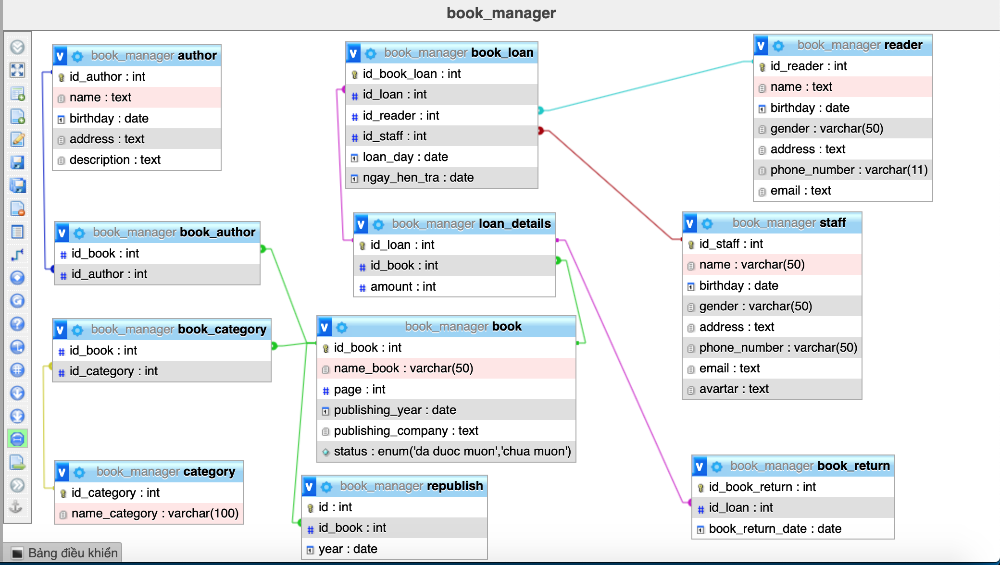
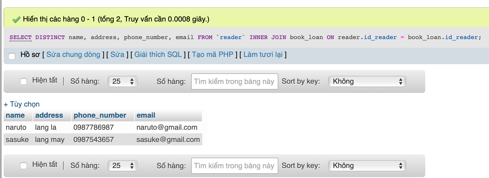
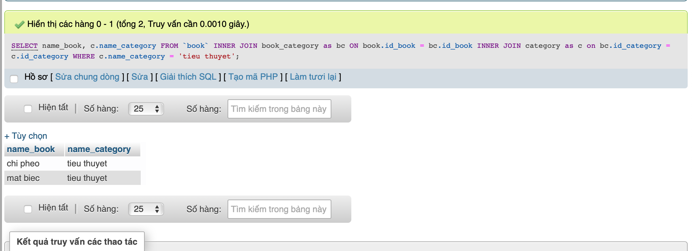
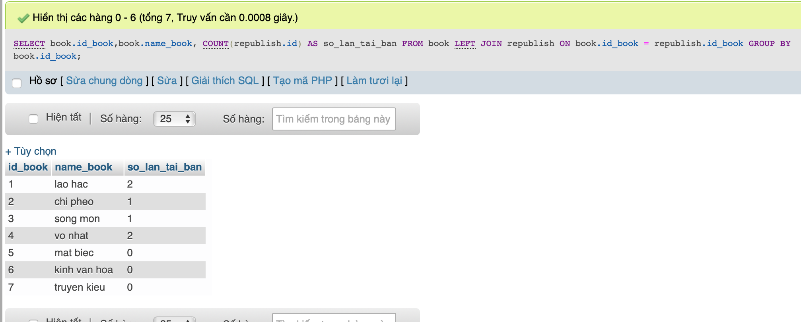
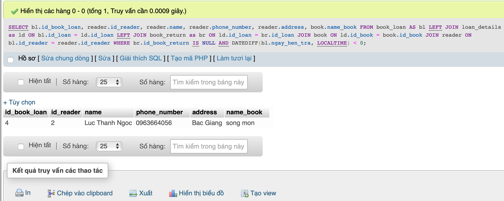

# Câu hỏi:
Sách(id, tên, số trang, năm xuất bản, nhà xuất bản, tính trạng, vị trí, số lượng)
Thể loại(id, tên thể loại)
sách_thể loại(id_sách, id_thể loại)
Tác giả(id, tên , ngày sinh, quê quán, mô tả)
sách_tác giả (id sach, id tác giả)
Tái bản(id, id_sách, năm)
Phiếu mượn(id, id_độc giả, id_nhan viên, ngày mượn, ngày hẹn trả )
Chi tiết mượn(id_phiếu mượn, id sách, số lượng)
Độc giả(id, tên , ngày sinh, giới tính, địa chỉ, sđt, email)
Nhân viên(id, tên , ngày sinh, giới tính, địa chỉ, sđt, email, avatar)
Phiếu trả(id, id phiếu mượn, ngày trả)

* Viết các câu lệnh DDL
* Thêm dữ liệu vào bảng
* Thực hiện các truy vấn sau:

    - Liệt kê danh sách độc giả đang mượn sách
    - Liệt kê các quyển sách thuộc thể loại bất kỳ
    - Đưa ra số lần tái bản của quyển sách bất kỳ
    - Liệt kê thông tin các độc giả mượn sách nhưng quá hạn trả và id, tên của quyển sách mà độc giả đó đang mượn (Gợi ý sử dụng DATEDIFF)

# thêm dữ liệu vào bảng

# thực hiện các truy vấn

* Liệt kê danh sách độc giả đang mượn sách

        SELECT DISTINCT name, address, phone_number, email
        FROM `reader` INNER JOIN book_loan ON reader.id_reader = book_loan.id_reader 

* Liệt kê các quyển sách thuộc thể loại bất kỳ.
trong phần này liệt kê các quyển sách thuộc thể loại 'tiểu thuyết'

        SELECT name_book, c.name_category
        FROM `book` INNER JOIN book_category as bc ON book.id_book = bc.id_book
        INNER JOIN category as c on bc.id_category = c.id_category
        WHERE c.name_category = 'tieu thuyet'

* Đưa ra số lần tái bản của quyển sách bất kỳ

        SELECT book.id_book,book.name_book, COUNT(republish.id) AS so_lan_tai_ban
        FROM book LEFT JOIN republish ON book.id_book = republish.id_book
        GROUP BY book.id_book

* Liệt kê thông tin các độc giả mượn sách nhưng quá hạn trả và id, tên của quyển sách mà độc giả đó đang mượn (Gợi ý sử dụng DATEDIFF)

        SELECT bl.id_book_loan, reader.id_reader, reader.name, reader.phone_number, reader.address, book.name_book
        FROM book_loan AS bl
        LEFT JOIN loan_details as ld ON bl.id_loan = ld.id_loan
        LEFT JOIN book_return as br ON ld.id_loan = br.id_loan
        JOIN book ON ld.id_book = book.id_book
        JOIN reader ON bl.id_reader = reader.id_reader
        WHERE  br.id_book_return IS NULL AND DATEDIFF(bl.ngay_hen_tra, LOCALTIME) < 0

